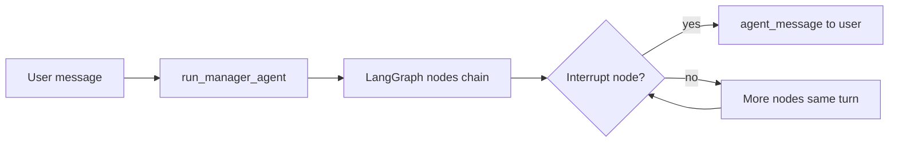
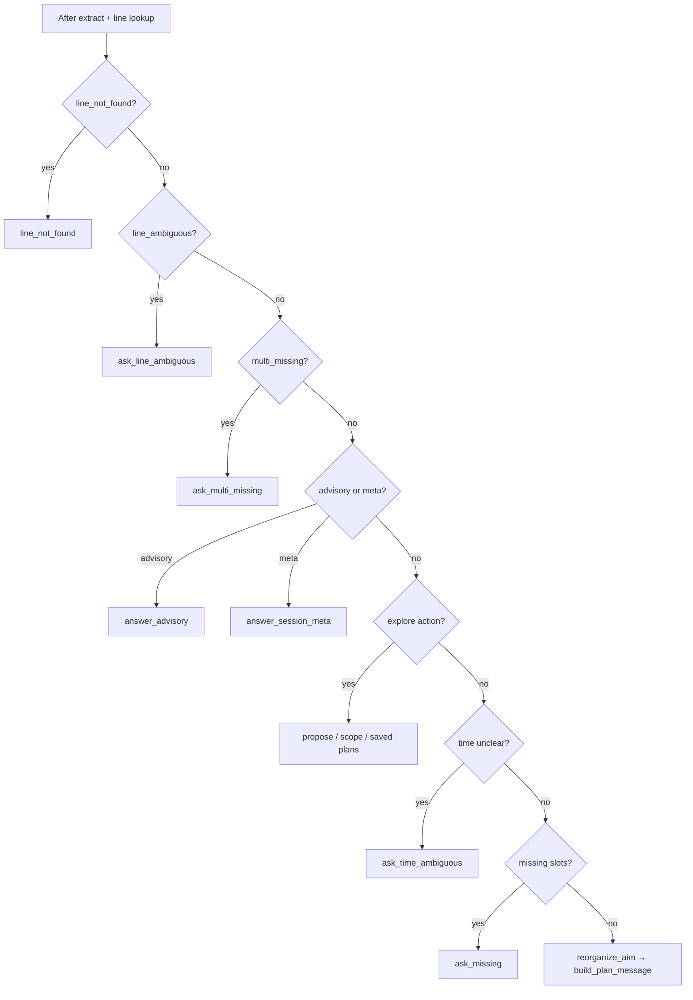

# Manager Agent — Deeper Architecture Guide

A learning-oriented guide to the manager agent LangGraph. After reading this document you should understand the mental models (state vs nodes vs phase), how LLM prompts are built, what interrupts mean, how the `ask_*` nodes differ, and how a multi-turn conversation flows step by step.

This doc answers: **"How do I actually think about this system?"** It complements — but does not replace — the exhaustive node reference and DB/API docs.

**Source code:** [`edas/backend/agents/manager/`](../edas/backend/agents/manager/)

**Related docs:**

| Doc | Purpose |
|-----|---------|
| [`manger_agent_only_langrph_flow.md`](manger_agent_only_langrph_flow.md) | Full node-by-node LangGraph reference (27 nodes, routing tables) |
| [`maanger_agents_detailed_Architecture.md`](maanger_agents_detailed_Architecture.md) | DB tables, API/CLI entry, persistence |
| [`manager_planner_flow_spec.md`](manager_planner_flow_spec.md) | Three lanes (direct / explore / advisory) |
| [`manager_agents_challenges_taclked.md`](manager_agents_challenges_taclked.md) | Product problems the manager solves |

---

## 1. Core mental model — three things people confuse

People often mix up these three concepts:

| Concept | What it is | Where it lives |
|---------|------------|----------------|
| **`ManagerState`** | One shared dict that flows through every node | [`state.py`](../edas/backend/agents/manager/state.py) |
| **Graph nodes** | Steps the pipeline runs: `extract_slots`, `ask_missing`, … | [`graph.py`](../edas/backend/agents/manager/graph.py) |
| **`phase`** | A string **field inside** state (`extract`, `ask`, `plan`, …) | Part of `ManagerState`, written by nodes |

**`phase` is not a graph node.** It is metadata that tells you where the conversation is (e.g. waiting for aim, showing a plan). Nodes read and write it as they run.



The manager agent is a **slot-filling conversational pipeline** for IoT data analysis:

1. Extract structured slots (line, time, aim) from natural language
2. Resolve line names against the IoT catalog
3. Sync session context (registry, datasets, task history)
4. Resolve or clarify time filters
5. Build a structured analysis plan (direct aim, explore proposals, or saved plans)
6. On user confirmation (`go`), save the task and hand off to the planner agent

---

## 2. One turn vs many nodes

| Rule | Detail |
|------|--------|
| One user message | One call to `run_manager_agent()` → `manager_graph.ainvoke(state, config)` |
| Many nodes per turn | The graph runs **many nodes back-to-back** before stopping |
| One stop per turn | **At most one interrupt** — the user sees **one** `agent_message` per turn |
| Entry point | Every turn starts at `inject_reference_time` (fresh `reference_now` each turn) |
| Session carry-over | Caller passes prior result as `existing_state` on the next turn |

**Runner inputs** ([`runner.py`](../edas/backend/agents/manager/runner.py)):

- `user_id`, `session_id`, `user_message`
- `existing_state` — slots, plan, proposals, chat history, phase, etc.
- Optional `line_name` — pre-fills `slots.line.mention` before the graph runs

**Runner outputs** (key fields):

- `agent_message` — text shown to the user (set by interrupt nodes)
- `phase`, `slots`, `missing`, `plan`, `line_context`, …
- `chat_history` — runner appends user + agent turn after the graph completes

---

## 3. How prompts are built (LLM nodes only)

Most nodes **do not** call an LLM. They route, query the DB, or build user text from Python templates. Only **6 prompt templates** exist.

### 3.1 The four-step pattern

1. **Template file** — [`prompts/*.md`](../edas/backend/agents/manager/prompts/)
2. **`load_prompt(name, **kwargs)`** — reads the `.md` file and runs Python `.format(**kwargs)` on placeholders ([`prompts.py`](../edas/backend/agents/manager/prompts.py))
3. **Helper formatters** inject structured context:
   - [`slots.session_state_for_llm()`](../edas/backend/agents/manager/slots.py) — session JSON for extract
   - [`schema_format.py`](../edas/backend/agents/manager/schema_format.py) — datasets, joins, inventory for prompts
   - [`context/session_inventory.py`](../edas/backend/agents/manager/context/session_inventory.py) — unified read model
4. **LangChain messages** sent to the model:
   - Usually: `[SystemMessage(system_prompt), HumanMessage(user_text)]`
   - Sometimes: recent `chat_history` inserted between system and human

### 3.2 All six LLM prompt templates

| Template | Node | System prompt gets | Human message gets | LLM returns |
|----------|------|-------------------|-------------------|-------------|
| `extract_slots.md` | `extract_slots` | `reference_now`, `session_state_json` | `user_message` (+ recent chat) | JSON slots / clarification |
| `normalize_time.md` | `resolve_time_filters` → `normalize_with_llm` | `reference_now`, phrase, validation errors | time phrase | JSON time range |
| `reorganize_aim.md` | `reorganize_aim` | datasets, joins, suggested aims, time JSON | raw aim text | JSON `aims[]`, `alias_name`, `notes` |
| `plan_benefits.md` | `build_plan_message` → `_generate_plan_benefits` | plan aims, dataset summaries | `"Benefits:"` | benefits bullet text |
| `propose_analysis_plans.md` | `propose_or_refine_plans` | full explore context, existing proposals | `user_message` (+ recent chat) | JSON `proposals[]` |
| `advisory_answer.md` | `answer_advisory` | line, datasets, plan, proposals, phase | `user_message` | advisory explanation text |

### 3.3 Chat history — only two LLM nodes use it

| Node | Sends `chat_history`? |
|------|----------------------|
| `extract_slots` | Yes — last N user/assistant pairs via `get_recent_chat_messages()` |
| `propose_or_refine_plans` | Yes |
| All other LLM nodes | No — single-turn system + human; context is in the system prompt |

### 3.4 Non-LLM nodes that still produce `agent_message`

These use Python templates, not `load_prompt`:

| Node / module | How message is built |
|---------------|---------------------|
| `ask_missing`, `ask_multi_missing`, `ask_line_ambiguous`, `ask_time_ambiguous` | [`prompt_hints.py`](../edas/backend/agents/manager/prompt_hints.py), [`message_format.py`](../edas/backend/agents/manager/message_format.py) |
| `answer_session_meta` | [`context/meta_responses.py`](../edas/backend/agents/manager/context/meta_responses.py) — template from `session_inventory` |
| `show_suggested_aims` | registry suggested aims + `prompt_hints` |
| `save_to_shortlist`, `list_saved_plans`, `combine_saved_plans`, `activate_saved_plan` | formatted strings in [`nodes/saved_plans.py`](../edas/backend/agents/manager/nodes/saved_plans.py) |
| `ask_scope_selection` | [`scope_selection.format_scope_menu()`](../edas/backend/agents/manager/scope_selection.py) |
| `line_not_found` | fixed error copy |

### 3.5 Per-LLM-node message shape (quick reference)

| Node | System | Middle | Human |
|------|--------|--------|-------|
| `extract_slots` | full extract prompt + session JSON | recent chat | current user message |
| `normalize_time` | normalize prompt | — | time phrase |
| `reorganize_aim` | reorganize prompt + schema | — | raw aim text |
| `plan_benefits` | benefits prompt + plan | — | `"Benefits:"` |
| `propose_or_refine_plans` | propose prompt + context | recent chat | user message |
| `answer_advisory` | advisory prompt + context | — | user message |

---

## 4. Interrupts — what they are and when they fire

### 4.1 Definition

The graph is compiled with `interrupt_after` on **13 nodes** ([`graph.py`](../edas/backend/agents/manager/graph.py)):

```text
ask_missing, ask_multi_missing, ask_time_ambiguous, build_plan_message,
line_not_found, ask_line_ambiguous, show_suggested_aims, propose_or_refine_plans,
answer_session_meta, answer_advisory, ask_scope_selection, save_to_shortlist,
list_saved_plans
```

After an interrupt node sets `agent_message`, the graph **pauses**. The caller returns that message to the user and waits for the **next** message.

**Important:** You do **not** get interrupted 13 times per turn. You get **at most one stop** per turn.

### 4.2 All 13 interrupt nodes — grouped by purpose

#### A. Slot filling (need more info from user)

| Node | When | User expected to… |
|------|------|-------------------|
| `ask_missing` | Line OK but `missing` includes `line` and/or `aim` (simple case) | Provide missing line name and/or analysis aim |
| `ask_multi_missing` | Multi-machine session needs structured clarification | Answer multi-line questions (pick line, skip line, clarify aim per line) |
| `ask_line_ambiguous` | Name matches 2+ catalog lines | Reply with exact line name from candidates |
| `ask_time_ambiguous` | Time phrase unclear or parse failed | Pick a time interpretation or rephrase |
| `ask_scope_selection` | Multi-line + user wants explore/proposals | Reply with scope number (e.g. **1** = all machines, **2** = one line) |

#### B. Errors

| Node | When | User expected to… |
|------|------|-------------------|
| `line_not_found` | DB lookup found no match | Try another line name |

#### C. Answers / options (user asked something, not just filling slots)

| Node | When | User expected to… |
|------|------|-------------------|
| `show_suggested_aims` | Tier-1: "what aims can we do?" | Pick an aim or ask for deeper options |
| `propose_or_refine_plans` | Tier-2: "more options", refine plans | Select/refine proposals ("use plan 1 and 2") |
| `answer_advisory` | Benefits, schema, "tell me more", next-steps questions | Continue; pick aim/plan or say **go** when plan exists |
| `answer_session_meta` | "what's loaded?", "what's missing?" | Continue after reading session status |

#### D. Plan / saved plans

| Node | When | User expected to… |
|------|------|-------------------|
| `build_plan_message` | Line + aim ready, plan built | Say **go** / **yes** to confirm, or request changes |
| `save_to_shortlist` | User saved a plan batch | Continue; combine, activate, or request more options |
| `list_saved_plans` | User asked to see saved plans | Pick saved plan to activate/combine |

### 4.3 Chaining — nodes that stop at `build_plan_message`

These nodes run **without** their own interrupt in the same turn, then chain into `build_plan_message` (which **does** interrupt):

- `reorganize_aim` → `build_plan_message`
- `merge_proposals_to_plan` → `build_plan_message`
- `combine_saved_plans` → `build_plan_message`
- `activate_saved_plan` → `build_plan_message`

### 4.4 Confirm shortcut (no interrupt list, but ends the session turn)

When `phase == "plan"` and the user says `go`, `confirm`, `yes`, `proceed`, or `ok`, the graph **skips** `extract_slots`:

```text
inject_reference_time → detect_confirm → save_task_definition → send_to_planner → END
```

---

## 5. Why `ask_missing` appears multiple times in routing docs

`ask_missing` is **one node**, not many. The flow reference lists **every path that can route to it**:

| Router | When it routes to `ask_missing` |
|--------|--------------------------------|
| `route_after_resolve_all_lines` | Line not fully synced yet; default fallback |
| `route_after_sync_session_context` | Context loaded, aim still missing |
| `route_after_time` | Time handled, `missing` still non-empty |

**Same node, different arrival paths** — not three separate asks in one turn.

---

## 6. The `ask_*` nodes — each fixes a different problem

Think of these as **specialized clarification screens**, not duplicates. The router checks conditions in priority order; **first match wins** ([`routing.py`](../edas/backend/agents/manager/routing.py)).

| Node | Trigger condition | What the user sees |
|------|-------------------|-------------------|
| `line_not_found` | `error == "line_not_found"` | "That line doesn't exist" |
| `ask_line_ambiguous` | `error == "line_ambiguous"` | "Multiple lines match … did you mean A or B?" |
| `ask_multi_missing` | `compute_multi_missing(slots).needs_any_clarification` | Structured multi-line questions |
| `ask_scope_selection` | explore action + `needs_scope_prompt(state)` | Numbered scope menu (all machines vs one) |
| `ask_time_ambiguous` | `time_needs_clarification(slots)` | "Did you mean …?" for time |
| `ask_missing` | Default when line OK but `missing` is non-empty | "What analysis would you like on **LINE**?" |

**Examples:**

- `"Vinayaka"` only → line OK, aim missing → **`ask_missing`**
- `"Vinayaka and LINE_B"` with unclear per-line aims → **`ask_multi_missing`**
- `"Vina"` matching two catalog lines → **`ask_line_ambiguous`**
- `"last week"` ambiguous → **`ask_time_ambiguous`**

### Router decision tree (simplified)



**Required slots** ([`slots.compute_missing()`](../edas/backend/agents/manager/slots.py)):

- `line` — must be resolved
- `aim` — must have `raw` or `aims`
- **Time is optional** — if the user says nothing about time, `resolve_time_filters` sets `no_filter=true` ("all data"). Time is **not** in `missing`.

---

## 7. Walkthrough — Turn 1: `"Vinayaka"` (new session)

Assumptions: empty session, Vinayaka exists in the IoT catalog (e.g. resolves to `FRUITS_TEST`).

| Step | Node | LLM? | What happens |
|------|------|------|--------------|
| 1 | `inject_reference_time` | No | Sets `reference_now` (anchor for relative time later) |
| 2 | `extract_slots` | **Yes** | LLM returns JSON: `line_mention="Vinayaka"`, `aim_raw=null`, `time_raw=null` |
| 3 | `merge_slots` | No | Writes into `slots`; `missing=["aim"]` |
| 4 | `resolve_all_lines` | No | DB lookup → `line.resolved=true`, `canonical` set, `lookup_locked=true` |
| 5 | `sync_session_context` | No | Loads datasets, columns, suggested aims → `line_context`, `session_inventory` |
| 6 | `resolve_time_filters` | No | No time mentioned → `time.no_filter=true`, `time.resolved=true` |
| 7 | `ask_missing` | No | **STOP** — shows line info + "What analysis on **VINAYAKA**?" |

`phase` becomes `"ask"`. Graph pauses until the next user message.

**Failure branches (same turn, different stop):**

- Line not in catalog → `line_not_found` → **STOP**
- Multiple matches → `ask_line_ambiguous` → **STOP**

```text
YOU: "Vinayaka"
  │
  ├─ inject_reference_time     (no stop)
  ├─ extract_slots             (LLM, no stop)
  ├─ merge_slots               (no stop)
  ├─ resolve_all_lines         (DB, no stop)
  ├─ sync_session_context      (no stop)
  ├─ resolve_time_filters      (no stop)
  └─ ask_missing               ◀── STOP, reply to user
```

---

## 8. Walkthrough — Turn 2: `"sales for past two days"`

Caller passes turn 1 result as `existing_state`. Vinayaka line is **lookup_locked** — extract preserves it.

| Step | Node | LLM? | What happens |
|------|------|------|--------------|
| 1 | `inject_reference_time` | No | Fresh `reference_now` |
| 2 | `extract_slots` | **Yes** | JSON: `aim_raw="sales"`, `time_raw="past two days"`; session JSON includes locked line |
| 3 | `merge_slots` | No | Updates aim + time slots; `missing=[]` |
| 4 | `resolve_all_lines` | No | Skips locked line |
| 5 | `sync_session_context` | No | Refreshes `line_context` |
| 6 | `resolve_time_filters` | **Yes** (if phrase needs parse) | `normalize_time` LLM → concrete `start`/`end` dates |
| 7 | `sync_session_context` | No | `registry_sync_target="reorganize"` triggers re-sync |
| 8 | `reorganize_aim` | **Yes** | Rewrites aim into structured `aims[]`, builds `plan` object |
| 9 | `build_plan_message` | Optional | Benefits LLM if missing; formats plan for user → **STOP** |

```text
YOU: "sales for past two days"
  │
  ├─ extract_slots … merge … resolve … sync … resolve_time …
  ├─ reorganize_aim            (LLM, no stop)
  └─ build_plan_message        ◀── STOP, show plan + "say go to confirm"
```

`phase` becomes `"plan"`.

---

## 9. Walkthrough — Turn 3: `"go"` (confirm shortcut)

When `phase == "plan"` and message is a confirm word:

| Step | Node | LLM? | What happens |
|------|------|------|--------------|
| 1 | `inject_reference_time` | No | Fresh timestamp |
| 2 | `detect_confirm` | No | Sets `task_confirmed=true`, builds `task_definition` |
| 3 | `save_task_definition` | No | Writes to `task_registry` in DB |
| 4 | `send_to_planner` | No | Builds `planner_payload`, sets final `agent_message` → **END** |

**Skips `extract_slots` entirely** — no slot re-extraction on confirm.

```text
YOU: "go"
  │
  ├─ detect_confirm
  ├─ save_task_definition
  └─ send_to_planner           ◀── STOP, handoff to planner
```

---

## 10. Three lanes (conversation routing)

After line resolution, the manager splits into three lanes. Full spec: [`manager_planner_flow_spec.md`](manager_planner_flow_spec.md).

| Lane | Trigger | Primary path |
|------|---------|--------------|
| **A — Direct plan** | User provides line + aim | `sync_session_context` → `resolve_time_filters` → `reorganize_aim` → `build_plan_message` → `go` |
| **B — Explore** | "more options", save/combine plans, tier-1/tier-2 browse | Scope menu → `propose_or_refine_plans` / `show_suggested_aims` → optional saved-plan nodes |
| **C — Advisory / meta** | Questions about benefits, schema, session state | `session_intent=advisory` → `answer_advisory` (LLM); `session_intent=meta_question` → `answer_session_meta` (templates) |

**Tier-1 vs Tier-2 (explore):**

- Tier-1: "what aims can we do?" → `show_suggested_aims` (fast registry list)
- Tier-2: "deeper options", "more analysis" → `propose_or_refine_plans` (LLM-generated proposals)

**Advisory** is classified by `extract_slots` (`clarification.session_intent: advisory`). When detected, explore actions and `aim_raw` merges are suppressed so follow-ups do not misroute to tier-2 propose or plan rebuild.

---

## 11. How to trace prompts in practice

When you need to know **exactly what is sent to the LLM** for a given node:

### Step 1 — Read the node file

Find `load_prompt(...)` and note every `kwargs` argument.

Example: [`nodes/extract.py`](../edas/backend/agents/manager/nodes/extract.py) passes `reference_now`, `session_state_json`, `user_message`.

### Step 2 — Read the prompt template

Open the matching file in [`prompts/`](../edas/backend/agents/manager/prompts/). Search for `{placeholder}` names and match them to the kwargs.

### Step 3 — Trace formatters

Follow helper functions that build injected context:

- `session_state_for_llm()` — what JSON goes into extract
- `format_datasets_for_prompt()`, `format_join_catalog_for_prompt()` — schema in reorganize/explore/advisory
- `format_context_inventory_for_prompt()` — dataset include/exclude policy
- `format_session_inventory_for_prompt()` — meta/advisory context

### Step 4 — Enable debug logging

Set `DEBUG=true` in `.env` (or `debug: true` in settings). Nodes call `debug_state()` and `debug()` in [`debug_log.py`](../edas/backend/agents/manager/debug_log.py), which print:

- Which node ran
- `phase`, `missing`, line mention/canonical, time, aim

This shows **which node ran and slot snapshot**, but not the full LLM prompt text.

### Step 5 — Inspect LLM payloads in tests

[`smoke_test.py`](../edas/backend/agents/manager/smoke_test.py) mocks `_get_llm()` and inspects `messages` in `ainvoke` — useful pattern for logging full system/human content during development.

You can also use `set_llm()` in [`nodes/extract.py`](../edas/backend/agents/manager/nodes/extract.py) to override the LLM in tests.

---

## 12. Common confusions (FAQ)

| Confusion | Reality |
|-----------|---------|
| "Interrupt" means I stay in a LangGraph state forever | No — interrupt means **pause after one node**, return `agent_message`, wait for next user message |
| `ask_missing` and `ask_line_ambiguous` are the same | No — each `ask_*` node handles a **specific** kind of gap or error |
| `ask_missing` listed 3× in docs = 3 asks per turn | No — **one node**, **three routes into it** from different routers |
| Every node calls the LLM | No — only **6** prompt templates; most nodes use DB, routing, or Python templates |
| Time must always be provided | No — silence on time → `no_filter=true` ("all data"); time is **not** a required slot |
| `phase` is a graph node | No — `phase` is a **string field** in `ManagerState` |
| Multiple interrupts per turn | No — **at most one** interrupt stop per user message |
| All LLM nodes get chat history | No — only `extract_slots` and `propose_or_refine_plans` include recent chat |
| Most work happens at the interrupt | No — extract, DB lookup, sync, time resolve, etc. all run **before** the stop in one burst |

---

## 13. Where to go next

| Need | Read |
|------|------|
| Every node, inputs/outputs, routing tables | [`manger_agent_only_langrph_flow.md`](manger_agent_only_langrph_flow.md) |
| PostgreSQL tables, API/CLI, what persists on `go` | [`maanger_agents_detailed_Architecture.md`](maanger_agents_detailed_Architecture.md) |
| Product lanes and confirm behavior | [`manager_planner_flow_spec.md`](manager_planner_flow_spec.md) |
| Problems the manager was built to solve | [`manager_agents_challenges_taclked.md`](manager_agents_challenges_taclked.md) |
| Graph wiring and interrupt list | [`graph.py`](../edas/backend/agents/manager/graph.py) |
| State schema | [`state.py`](../edas/backend/agents/manager/state.py) |
| Routing logic | [`routing.py`](../edas/backend/agents/manager/routing.py) |
