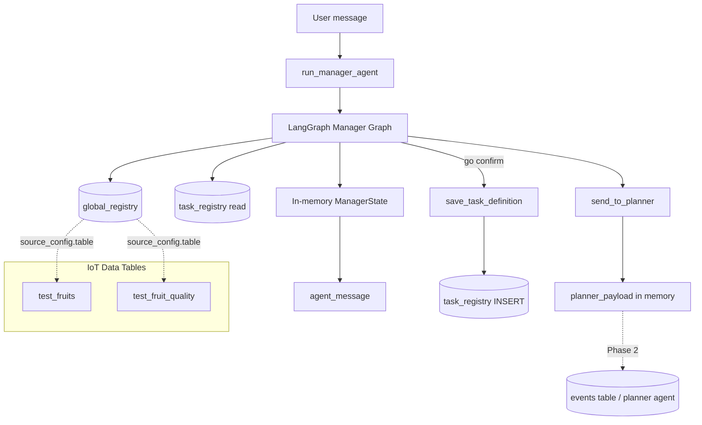

# Manager Agent — Detailed Architecture

High-level architecture for the EDAS Manager Agent: database tables, request inflow, conversational flow, and what is persisted when a session ends.

After reading this document you should know which PostgreSQL tables exist, how a user message flows through the manager, and exactly what gets saved (or not) when the session ends on **`go`**.

**Related docs:**

| Doc | Purpose |
|-----|---------|
| [`deeper_understand_architecture.md`](deeper_understand_architecture.md) | Conceptual guide — mental models, prompts, interrupts, walkthroughs |
| [`manger_agent_only_langrph_flow.md`](manger_agent_only_langrph_flow.md) | Node-by-node LangGraph reference |
| [`manager_planner_flow_spec.md`](manager_planner_flow_spec.md) | Three lanes (direct / explore / advisory) |
| [`manager_agents_challenges_taclked.md`](manager_agents_challenges_taclked.md) | Problems the manager solves |

**Source code:** [`edas/backend/agents/manager/`](../edas/backend/agents/manager/)

---

## 1. System overview

The Manager Agent is a **LangGraph conversational pipeline** that turns natural language into a structured analysis plan and, on user confirmation, hands off to downstream agents.

| Layer | Role |
|-------|------|
| **Entry** | CLI (`agents/manager/cli.py`) or REST API (`api/routes/manager.py` → `session_service.run_session_turn`) |
| **Orchestration** | LangGraph graph in `agents/manager/graph.py` (27 nodes) |
| **State** | `ManagerState` in `agents/manager/state.py` — slots, plan, proposals, saved plans, etc. |
| **Catalog / history DB** | PostgreSQL: `global_registry`, `task_registry` (read + write on confirm) |
| **Session memory** | PostgreSQL: `manager_sessions.state_json` + `chat_history` rows; LangGraph `MemorySaver` for in-process checkpoints |
| **Event bus (EDAS)** | `events` / `results` — used by legacy research/executor flow; manager confirm is **not** on the bus yet (Phase 2) |

The manager **does not run analysis**. It stops after building `planner_payload` and saving `task_definition` to the database.

### Execution model

| Concept | Detail |
|---------|--------|
| One turn | `run_manager_agent()` in [`runner.py`](../edas/backend/agents/manager/runner.py) calls `manager_graph.ainvoke(state, config)` |
| Session persistence | `manager_sessions` table (`state_json`); `chat_history` table (user/agent rows per turn); `MemorySaver` checkpointer; `config = {"configurable": {"thread_id": session_id}}` |
| Multi-turn CLI | Caller passes prior turn's return dict as `existing_state` |
| Multi-turn API | [`session_service.py`](../edas/backend/agents/manager/session_service.py) loads `state_json`, runs turn, saves state + chat rows |
| Human-in-the-loop | Graph compiled with `interrupt_after` on 13 nodes — stops after those nodes so the caller can return `agent_message` to the user |
| Entry point | Every turn starts at `inject_reference_time` (fresh `reference_now` each turn) |

---

## 2. Database tables

### 2.1 Platform tables (EDAS core)

From migrations `001_initial.sql`, `003_manager_tables_fresh.sql`, `005_drop_schema_registry.sql`, `007_manager_sessions.sql`.

| Table | Purpose | Manager usage |
|-------|---------|-----------------|
| **`users`** | Auth users (UUID, email, password_hash) | Default `user_id` from config in CLI / API |
| **`events`** | Event bus outbox (topic, payload JSONB, status, execute_at) | Not written by manager today; used by `/task` API and agent subscribers |
| **`results`** | Completed task outputs linked to events | Written when `task.complete` / `task.failed` fire — not by manager |
| **`chat_history`** | Persistent chat rows (user_id, session_id, role, content, node) | **Write** on each API turn (user + agent rows); also held in `state_json.chat_history` for LLM context |
| **`manager_sessions`** | Session metadata + `state_json` JSONB | **Read/write** on each API turn — resumable slots, plan, proposals, phase |
| **`global_registry`** | IoT catalog: lines, datasets, columns, joins, suggested aims | **Read** on every line sync and line lookup |
| **`task_registry`** | Per-user versioned saved task definitions (JSONB) | **Read** for task history / alias lookup; **Write** on user `go` |

**Removed:** `schema_registry` was dropped in migration 005. `global_registry` is the sole schema source.

SQLAlchemy models live in [`edas/backend/db/models.py`](../edas/backend/db/models.py).

### 2.2 IoT data tables (actual analysis data)

These are **not** manager metadata tables. They hold the raw data and are referenced inside `global_registry.source_config.table`:

| Physical table | Registered as | Line | Role |
|----------------|---------------|------|------|
| **`test_fruits`** | dataset `fruits` | `FRUITS_TEST` | primary |
| **`test_fruit_quality`** | dataset `fruit_quality` | `FRUITS_TEST` | secondary (joins on `batch_id`) |

Example resolution: user says *"Vinayaka"* → synonym in `global_registry` → canonical line **`FRUITS_TEST`** → datasets loaded from registry → physical tables `test_fruits` / `test_fruit_quality`.

Seeded by [`edas/backend/db/seed_fruits_global.py`](../edas/backend/db/seed_fruits_global.py). Migrations: `004_test_fruits.sql`, `006_test_fruit_quality.sql`.

### 2.3 Key column shapes

**`global_registry`** (one row per line + dataset):

| Column | Role |
|--------|------|
| `line_name`, `dataset_name` | Unique pair identifying a dataset on a production line |
| `synonyms` | JSONB array — user-friendly names (e.g. `"Vinayaka"`) |
| `source_type`, `source_config` | How to reach data (e.g. `pg` + `{ "table": "test_fruits" }`) |
| `column_definitions` | JSONB array of column metadata (name, meaning, datatype) |
| `role` | `primary` or `secondary` |
| `join_hints` | Cross-dataset join edges (e.g. `batch_id`) |
| `suggested_aims` | Tier-1 registry aims shown to the user |
| `status` | `active` / inactive — only active rows are loaded |

**`task_registry`** (append-only versions per user + line):

| Column | Role |
|--------|------|
| `user_id`, `line_name` | Owner and canonical line |
| `version` | Auto-increment per `(user_id, line_name)` |
| `task_definition` | JSONB — see §4.2 for saved shape |

**`events`** (event bus):

| Column | Role |
|--------|------|
| `topic` | e.g. `task.new`, `research.start`, `executor.run`, `task.complete` |
| `payload` | JSONB event body |
| `status` | `pending` → consumed by worker loop |

**`results`** (downstream outputs):

| Column | Role |
|--------|------|
| `event_id` | Links to originating event |
| `task`, `result` | Task description and JSONB result payload |
| `status` | e.g. `complete`, `failed` |

---

## 3. Manager inflow — one conversational turn

### 3.1 Entry point

```
run_manager_agent(user_id, session_id, line_name, user_message, existing_state)
```

Defined in [`runner.py`](../edas/backend/agents/manager/runner.py).

| Input | Effect |
|-------|--------|
| `user_id` | Line lookup (task alias), task history, task save |
| `session_id` | LangGraph checkpointer `thread_id` |
| `user_message` | Current utterance |
| `line_name` | Optional pre-fill of `slots.line.mention` before graph runs |
| `existing_state` | Prior turn result — **this is how multi-turn sessions work in CLI** |

Each turn:

1. Merge `existing_state` with defaults from `_default_state()` (empty slots, `phase="extract"`, etc.)
2. Invoke `manager_graph.ainvoke(state, { "configurable": { "thread_id": session_id } })`
3. Append user + agent messages to `chat_history` via `append_turn_to_history`
4. Return full state dict to caller (CLI keeps it in a loop)

### 3.2 Graph entry and routing

Every turn starts at **`inject_reference_time`** (fresh `reference_now` for relative dates like *"last week"*).

Then either:

**A — Confirm shortcut** (if `phase == "plan"` and user says `go` / `yes` / `confirm` / `proceed` / `ok`):

```
inject_reference_time → detect_confirm → save_task_definition → send_to_planner → END
```

**B — Normal slot-filling path:**

```
inject_reference_time → extract_slots → merge_slots → resolve_all_lines
  → [line errors / ask / explore / advisory / meta]
  → sync_session_context → resolve_time_filters
  → reorganize_aim | propose_or_refine_plans | saved_plans nodes
  → build_plan_message → END (interrupt — wait for user)
```

The graph pauses after **13 interrupt nodes** (`ask_missing`, `build_plan_message`, `propose_or_refine_plans`, `answer_advisory`, etc.) so the caller can show `agent_message` and wait for the next user input.

### 3.3 Three lanes (after line is resolved)

See [`manager_planner_flow_spec.md`](manager_planner_flow_spec.md).

| Lane | Trigger | Path |
|------|---------|------|
| **A — Direct plan** | Line + aim provided | `sync_session_context` → `resolve_time_filters` → `reorganize_aim` → `build_plan_message` |
| **B — Explore** | "more options", save/combine plans | scope menu (multi-line) → `propose_or_refine_plans` → optional `save_to_shortlist` / `list_saved_plans` / `combine_saved_plans` / `activate_saved_plan` |
| **C — Advisory / meta** | Questions about benefits, schema, session | `session_intent=advisory` → `answer_advisory` (LLM); `session_intent=meta_question` → `answer_session_meta` (templates) — no plan overwrite |

### 3.4 DB reads during a turn

| Step | Node / service | DB table | Operation |
|------|----------------|----------|-----------|
| Line resolution | `resolve_all_lines` → `db.resolve_line_lookup` | `global_registry` | Match `line_name` or `synonyms` |
| Task alias | same | `task_registry` | Match `task_definition.alias_name` for user |
| Registry sync | `sync_registry_context` → `fetch_global_datasets` | `global_registry` | Load all active datasets for resolved line(s) |
| Task history | `sync_session_context` → `load_task_history_for_state` | `task_registry` | Last N versions for prompts / reuse |
| Confirm | `detect_confirm` → `sync_verification_context` | — | Schema verify (local mock or bus mode) |
| Save | `save_task_definition_node` → `save_task_definition` | `task_registry` | **INSERT** new version row |

DB access is centralized in [`agents/manager/db.py`](../edas/backend/agents/manager/db.py).

Line lookup order: **exact line_name → synonym → task alias** (see `resolve_line_lookup`).

### 3.5 In-memory state (not persisted to DB between turns)

Held in `existing_state` / LangGraph checkpointer (`MemorySaver` — process-local, not durable across server restart):

| Field | Role |
|-------|------|
| `slots` | line, time, aim, line_slots, dataset_context |
| `plan` | Active plan shown to user (line, time, aims, benefits) |
| `analysis_proposals` | Current explore batch (up to 3 numbered proposals) |
| `saved_plans` | Session shortlist S1–S5 |
| `session_goal`, `user_explore_intent` | Optional explore focus |
| `scope_selection`, `scope_pending` | Multi-machine explore scope (`"all"` or single line) |
| `iot_column_wishes` | Future column ideas — suggestions only, never merged into aims |
| `chat_history` | LangChain messages for LLM context in extract/advisory |
| `session_inventory` | Unified read model for meta answers (built from state + DB reads) |
| `line_context`, `explore_context`, `dataset_context` | Registry bundles and scope policy |
| `time_context` | Time inventory snapshot |
| `verification_context` | Schema readiness (populated on confirm) |

Full field reference: [`state.py`](../edas/backend/agents/manager/state.py) and [`manger_agent_only_langrph_flow.md`](manger_agent_only_langrph_flow.md) §3.

---

## 4. End of session — what happens on `go`

When the user confirms an existing plan (`phase == "plan"`), the confirm shortcut runs three nodes in sequence.

### Step 1 — `detect_confirm`

- Sets `task_confirmed = true`, `phase = "confirm"`
- Builds **`task_definition`** from `plan` + resolved `slots.time` + dataset scope
- Runs **`verification_context`** via `sync_verification_context` (schema readiness check)

Task definition shape built in code:

```json
{
  "aims": ["..."],
  "alias_name": "FRUITS_TEST",
  "notes": null,
  "time_range": { "start": "...", "end": "..." },
  "datasets_in_scope": [...],
  "datasets_excluded": [...]
}
```

If `time.no_filter` is set or time is unresolved, `time_range` is `null`.

### Step 2 — `save_task_definition` → **`task_registry`**

**Persisted to PostgreSQL.**

Implementation in [`db.save_task_definition`](../edas/backend/agents/manager/db.py):

1. `SELECT MAX(version)` for `(user_id, line_name)`
2. `INSERT` new row with `version + 1` and full `task_definition` JSONB
3. Returns new version number

This is the **only write** the manager performs during a normal session. Prior versions remain for task reuse (*"same as last Vinayaka analysis"*).

### Step 3 — `send_to_planner`

- Sets **`planner_payload`** and **`phase = "done"`**
- **Not persisted to DB** in current CLI mode — returned in memory only
- Logs payload; message notes *"CLI mode — not published to bus"*

Planner payload includes:

| Key | Source |
|-----|--------|
| `line_name` | Canonical line from slots |
| `schema`, `datasets` | From `line_context` |
| `task_definition`, `time_range` | From confirm step |
| `datasets_in_scope`, `datasets_excluded`, `dataset_schemas` | From schema payload builder |
| `join_catalog` | Normalized join edges |
| `saved_plans` | Session shortlist (if any) |
| `iot_column_wishes`, `session_goal` | Optional session metadata |

CLI exits the loop when `planner_payload` is present ([`cli.py`](../edas/backend/agents/manager/cli.py)).

### 4.1 Persistence summary

| Artifact | Where | When |
|----------|-------|------|
| **Task definition** | `task_registry` (PostgreSQL) | On **`go`** only |
| **Planner handoff** | `state.planner_payload` / `manager_sessions.state_json` | On **`go`**; event bus publish = Phase 2 |
| **Chat turns** | `chat_history` table + `state_json.chat_history` | Every API turn (2 rows per turn) |
| **Session state** | `manager_sessions.state_json` | Every API turn (slots, plan, proposals, saved plans, phase) |
| **Explore shortlist S1–S5** | `manager_sessions.state_json` (API) or in-memory (CLI) | Survives server restart when using API |
| **Analysis proposals batch** | `manager_sessions.state_json` (API) | Cleared on reject or new explore |
| **Global catalog** | `global_registry` | Maintained by IoT seed/admin — manager read-only |
| **Analysis results** | `results` | Downstream executor/research — not written by manager |

### 4.2 What is NOT saved at session end

- LangGraph checkpoint (`MemorySaver` — in-process only; API uses `state_json` as source of truth)
- `planner_payload` to event bus (unless Phase 2 bus integration is enabled)

### 4.3 REST API (manager sessions)

| Method | Path | Purpose |
|--------|------|---------|
| `POST` | `/manager/sessions` | Create session → `{ session_id, status }` |
| `GET` | `/manager/sessions` | List sessions for default user |
| `GET` | `/manager/sessions/{session_id}` | Session metadata + messages + `ui` summary |
| `POST` | `/manager/sessions/{session_id}/messages` | Send message → agent reply + updated `ui` |

Implementation: [`api/routes/manager.py`](../edas/backend/api/routes/manager.py), [`session_service.py`](../edas/backend/agents/manager/session_service.py), [`session_db.py`](../edas/backend/agents/manager/session_db.py), [`session_store.py`](../edas/backend/agents/manager/session_store.py).

---

## 5. Architecture diagram



### Turn lifecycle (simplified)

```mermaid
sequenceDiagram
    participant U as User
    participant R as run_manager_agent
    participant G as LangGraph
    participant GR as global_registry
    participant TR as task_registry

    U->>R: user_message + existing_state
    R->>G: ainvoke(thread_id=session_id)
    G->>GR: resolve line / load datasets
    G->>TR: fetch task history (if line resolved)
    G-->>R: state + agent_message
    R-->>U: show reply; keep state

    Note over U,TR: User says "go" when phase=plan

    U->>R: go
    R->>G: confirm shortcut
    G->>TR: INSERT task_definition (new version)
    G-->>R: planner_payload, phase=done
    R-->>U: session complete
```

---

## 6. Downstream agents (EDAS context)

The wider EDAS backend also runs an event-driven pipeline separate from the manager CLI path:

| Agent | Subscribes to | Publishes / writes |
|-------|---------------|-------------------|
| **Research agent** | `research.start`, `research.retry`, `research.result` | `executor.run` |
| **Executor agent** | `executor.run` | query results back to research |
| **DB subscriber** | `task.complete`, `task.failed` | **`results`** table |

Events are stored in **`events`** via [`bus/publisher.py`](../edas/backend/bus/publisher.py). The `/task` API publishes `task.new` events.

The manager LangGraph path is currently **decoupled** from that bus until planner integration (Phase 2). `send_to_planner` builds the payload but does not call `publish()` yet.

---

## 7. Quick reference — "I finished a session, what exists?"

After a successful **`go`**:

1. **In the database:** one new row in **`task_registry`** (versioned `task_definition` for that `user_id` + canonical `line_name`).
2. **In the CLI/process:** **`planner_payload`** ready for the planner agent; **`phase = "done"`**.
3. **Still only in memory:** chat history, saved plan shortlist (S1–S5), proposals, most slot state.
4. **Unchanged by manager:** **`global_registry`**, IoT tables **`test_fruits`** / **`test_fruit_quality`**, **`events`** / **`results`** (unless a separate task pipeline ran).

### State buckets (mental model)

| Bucket | Persists across turns? | Persists to DB? |
|--------|------------------------|-----------------|
| `slots`, `plan`, proposals, saved_plans | Yes (in `existing_state` or `state_json`) | Yes (`manager_sessions` on API) |
| `task_registry` versions | N/A (loaded on demand) | Yes (on `go`) |
| `global_registry` catalog | N/A (loaded on demand) | Yes (IoT admin/seed) |
| `planner_payload` | Single turn at end | No (Phase 2: via `events`) |

---

## 8. File map

| File | Responsibility |
|------|----------------|
| `agents/manager/runner.py` | Turn entry, state merge, chat history append |
| `agents/manager/session_service.py` | API turn orchestration (load → run → save) |
| `agents/manager/session_db.py` | `manager_sessions` + `chat_history` CRUD |
| `agents/manager/session_store.py` | State JSON serialize/deserialize, UI summary |
| `api/routes/manager.py` | REST endpoints for manager chat |
| `agents/manager/graph.py` | LangGraph definition, routing, interrupts |
| `agents/manager/routing.py` | Conditional edge functions |
| `agents/manager/state.py` | `ManagerState` TypedDict |
| `agents/manager/db.py` | PostgreSQL reads/writes for registry and tasks |
| `agents/manager/nodes/` | Individual graph nodes (extract, plan, explore, …) |
| `agents/manager/context/` | Session inventory, task history, time, verification |
| `db/models.py` | SQLAlchemy table models |
| `db/migrations/` | Schema DDL |
