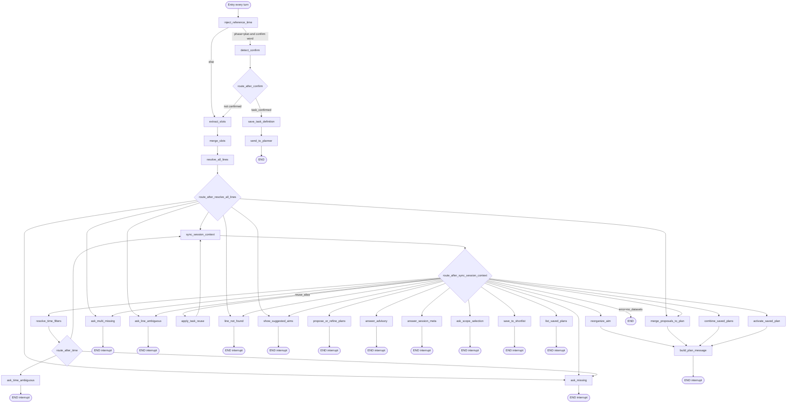
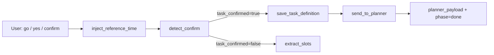

# Manager Agent — LangGraph Flow

Standalone reference for the manager agent LangGraph. After reading this document you should understand how each conversational turn flows through nodes, what state is read and written at every step, where the graph pauses for user input, what supporting services run (time injection, registry sync, verification, etc.), and how confirmation hands off to the planner agent.

**Source code:** [`edas/backend/agents/manager/graph.py`](../edas/backend/agents/manager/graph.py)  
**Product spec (three lanes):** [`manager_planner_flow_spec.md`](manager_planner_flow_spec.md)

---

## 1. Overview

The manager agent is a **slot-filling conversational pipeline** for IoT data analysis requests. It:

1. Extracts structured slots (line, time, aim) from natural language
2. Resolves line names against the IoT catalog (exact name, synonym, or task alias)
3. Syncs session context (registry, time inventory, task history, session inventory)
4. Resolves or clarifies time filters
5. Builds a structured analysis plan (direct aim rewrite, explore-aims proposals, or saved-plan shortlist)
6. On user confirmation, saves the task definition, verifies schema readiness, and builds a **planner payload**

### Execution model

| Concept | Detail |
|---------|--------|
| One turn | `run_manager_agent()` in [`runner.py`](../edas/backend/agents/manager/runner.py) calls `manager_graph.ainvoke(state, config)` |
| Session persistence | `MemorySaver` checkpointer; `config = {"configurable": {"thread_id": session_id}}` |
| Human-in-the-loop | Graph compiled with `interrupt_after` on **13 nodes** — execution stops after those nodes so the caller can return `agent_message` to the user |
| Entry point | Every turn starts at `inject_reference_time` (fresh `reference_now` each turn) |
| Node count | **27 registered nodes** |

### Three lanes after line resolution

See also [`manager_planner_flow_spec.md`](manager_planner_flow_spec.md).

| Lane | Trigger | Primary path |
|------|---------|--------------|
| **A — Direct plan** | Line + aim provided | `sync_session_context` → `resolve_time_filters` → `reorganize_aim` → `build_plan_message` → `go` |
| **B — Explore** | "more options", save/combine plans | Scope menu (multi-line) → `propose_or_refine_plans` → optional `save_to_shortlist` / `list_saved_plans` / `combine_saved_plans` / `activate_saved_plan` |
| **C — Advisory / meta** | Questions about benefits, schema, session state | `session_intent=advisory` → `answer_advisory` (LLM); `session_intent=meta_question` → `answer_session_meta` (templates) |

### Confirm shortcut

When `phase == "plan"` and the user message is a confirm word (`go`, `confirm`, `yes`, `proceed`, `ok`), the graph **skips slot extraction** and routes directly to:

```
inject_reference_time → detect_confirm → save_task_definition → send_to_planner
```

---

## 2. External inputs and outputs (per turn)

### Inputs

Passed into `run_manager_agent(user_id, session_id, line_name, user_message, existing_state)`:

| Field | Source | Role |
|-------|--------|------|
| `user_id` | API / CLI | User identity; used in line lookup and task save |
| `session_id` | API / CLI | LangGraph checkpointer thread ID |
| `user_message` | User | Current utterance; written to `state.user_message` each turn |
| `line_name` | Optional CLI hint | If non-empty, pre-fills `slots.line.mention` before graph runs |
| `existing_state` | Prior turn result | Carries slots, plan, proposals, saved plans, chat history, phase, etc. |

The runner merges `existing_state` with defaults from `_default_state()` (empty slots, `phase="extract"`, etc.).

### Outputs

Returned dict after the graph run (plus chat history append in runner):

| Field | When populated |
|-------|----------------|
| `agent_message` | Ask, plan, explore, advisory, meta, or error nodes — text shown to the user |
| `phase` | Pipeline stage: `extract`, `resolve`, `context`, `ask`, `explore`, `plan`, `confirm`, `done` |
| `slots` | Progressive slot filling (`line`, `time`, `aim`, `line_slots`, …) |
| `missing` | List of still-missing slot names, e.g. `["line"]`, `["aim"]` |
| `line_context` | Dataset summaries, columns, joins, suggested aims for active line |
| `explore_context` | Multi-line / cross-dataset exploration metadata |
| `dataset_context` | Per-line dataset include/exclude policy and bundles |
| `time_context` | Time inventory snapshot (status, bounds, ambiguity) |
| `session_inventory` | Unified read model for meta answers and LLM prompts |
| `plan` | Structured plan: line, time range, aims, alias, notes, benefits |
| `analysis_proposals` | Up to 3 explore-aims proposal objects (current batch) |
| `saved_plans` | Session shortlist S1–S5 (persisted across turns in session state) |
| `task_definition` | Final confirmed task (aims, time_range, datasets in/out of scope) |
| `verification_context` | Schema readiness check result (on confirm) |
| `planner_payload` | Handoff payload for planner agent (set on `send_to_planner`) |
| `session_intent` | `advisory`, `meta_question`, or null — set by `extract_slots` |
| `scope_selection` / `scope_pending` | Multi-machine explore scope |
| `session_goal` / `user_explore_intent` | Optional explore focus |
| `iot_column_wishes` | Suggestions only — never merged into aims |
| `error` | Machine-readable error: `line_not_found`, `line_ambiguous`, `no_datasets` |
| `chat_history` | LangChain messages; runner appends user + agent turn |

---

## 3. State schema

Defined in [`state.py`](../edas/backend/agents/manager/state.py) as `ManagerState`.

### 3.1 Top-level fields

| Field | Type | Description | Primary writers |
|-------|------|-------------|-----------------|
| `user_id` | `str` | User identity | Runner (input) |
| `session_id` | `str` | Session / thread ID | Runner (input) |
| `user_message` | `str` | Current user utterance | Runner (input) |
| `reference_now` | `str` | ISO timestamp anchor for relative time parsing | `inject_reference_time` |
| `reference_timezone` | `str` | Timezone label (default `UTC`) | `inject_reference_time` |
| `slots` | `dict` | All slot-filling data (see §3.2) | Most pipeline nodes |
| `missing` | `list[str]` | Missing required slots: `"line"`, `"aim"` | `extract_slots`, `merge_slots`, resolvers |
| `line_context` | `dict \| None` | Active line registry bundle | `sync_session_context` (via internal registry sync) |
| `plan` | `dict \| None` | Confirmed-style plan object | `reorganize_aim`, `merge_proposals_to_plan`, saved-plan nodes |
| `phase` | `str` | Current pipeline phase | Most nodes |
| `chat_history` | `list` (reducer: `add_messages`) | Conversation messages for LLM context | Runner (append) |
| `task_confirmed` | `bool` | User confirmed the plan | `detect_confirm`, cleared by `extract_slots` |
| `task_definition` | `dict \| None` | Saved task structure | `detect_confirm` |
| `planner_payload` | `dict \| None` | Planner agent handoff | `send_to_planner` |
| `agent_message` | `str` | Reply text for the user | Ask / plan / explore / advisory / meta nodes |
| `error` | `str \| None` | Routing error code | `resolve_all_lines`, `sync_session_context` |
| `wants_suggested_aims` | `bool` | User asked to see suggested aims | `extract_slots`, cleared by explore/aim nodes |
| `analysis_proposals` | `list[dict] \| None` | Explore-aims proposals (ids 1–3) | `propose_or_refine_plans` |
| `explore_phase` | `str \| None` | `proposing` or `refining` | `propose_or_refine_plans` |
| `aim_exploration` | `dict \| None` | Parsed explore action from LLM clarification | `extract_slots` |
| `explore_context` | `dict \| None` | Multi-line exploration scope | `sync_session_context` |
| `dataset_context` | `dict \| None` | Dataset policy across lines | `sync_session_context`, `extract_slots` |
| `registry_sync_target` | `str \| None` | Post-sync routing hint; `"reorganize"` triggers aim rewrite | `resolve_time_filters`, `apply_task_reuse` |
| `time_context` | `dict \| None` | Time inventory snapshot | `sync_session_context` |
| `session_inventory` | `dict \| None` | Unified session read model | `sync_session_context` |
| `session_intent` | `str \| None` | `advisory`, `meta_question`, or null | `extract_slots` |
| `verification_context` | `dict \| None` | Schema readiness on confirm | `detect_confirm` |
| `reuse_alias` | `str \| None` | Prior task alias for reuse | `extract_slots` → `apply_task_reuse` |
| `saved_plans` | `list[dict] \| None` | Session shortlist S1–S5 | `save_to_shortlist`, `extract_slots` |
| `session_goal` | `str \| None` | User-stated session focus | `extract_slots` |
| `user_explore_intent` | `str \| None` | Optional focus for propose/refine | `extract_slots` |
| `scope_selection` | `str \| None` | `"all"` or canonical line name | `extract_slots`, scope reply |
| `scope_pending` | `bool` | Awaiting numbered scope reply | `ask_scope_selection`, `extract_slots` |
| `iot_column_wishes` | `list[dict] \| None` | Column suggestions only — never in aims | `extract_slots`, `answer_advisory` |

### 3.2 Default `slots` shape

From [`slots.py`](../edas/backend/agents/manager/slots.py) `empty_slots()`:

```json
{
  "line": {
    "mention": null,
    "canonical": null,
    "resolved": false,
    "source": null,
    "candidates": []
  },
  "time": {
    "raw": null,
    "start_raw": null,
    "end_raw": null,
    "mentioned": false,
    "start": null,
    "end": null,
    "resolved": false,
    "ambiguous": false,
    "interpretations": [],
    "no_filter": false,
    "parse_error": null,
    "canonical": null
  },
  "aim": {
    "raw": null,
    "aims": [],
    "reorganized": false
  },
  "scope": {
    "slot_count": 0,
    "intent_mode": "single",
    "joint_aim_raw": null,
    "joint_time_raw": null
  },
  "line_slots": [],
  "active_line_index": null,
  "dataset_context": { }
}
```

### 3.3 `line_slots` entry (multi-line)

Each item in `slots.line_slots` (from `empty_line_slot()`):

| Field | Meaning |
|-------|---------|
| `mention` | User-provided line text |
| `canonical` | Resolved catalog name |
| `resolved` | Whether lookup succeeded |
| `source` | `line_name`, `synonym`, or `task_alias` |
| `candidates` | Ambiguous match list |
| `status` | `pending`, `resolved`, `not_found`, `ambiguous` |
| `aim_raw`, `time_raw` | Per-line slot overrides |
| `skipped` | User chose to skip this line |
| `lookup_locked` | Lookup result is final for this slot |

### 3.4 `missing` computation

`compute_missing(slots)` returns:

- `"line"` if `slots.line.resolved` is false
- `"aim"` if neither `slots.aim.raw` nor `slots.aim.aims` is set

Time is **not** in `missing`; ambiguous/unparsed time is handled separately via `time_needs_clarification()`.

### 3.5 `plan` object shape

Built by `reorganize_aim`, `merge_proposals_to_plan`, or saved-plan nodes:

| Field | Content |
|-------|---------|
| `line` | Canonical line name |
| `time_start`, `time_end` | Resolved ISO bounds (may be null) |
| `aims` | List of analysis aim strings |
| `alias_name` | Task alias for reuse |
| `notes` | Optional LLM or exploration notes |
| `benefits` | Optional LLM-generated benefits (added by `build_plan_message`) |

### 3.6 `task_definition` object shape

Built by `detect_confirm`:

| Field | Content |
|-------|---------|
| `aims` | From plan or slots |
| `alias_name` | Plan alias or line name |
| `notes` | Plan notes |
| `time_range` | `{start, end}` or null if no filter |
| `datasets_in_scope` | From registry schema payload |
| `datasets_excluded` | Excluded datasets per policy |

### 3.7 `planner_payload` object shape

Built by `send_to_planner`:

| Field | Content |
|-------|---------|
| `line_name` | Canonical line |
| `schema` | Line schema from `line_context` |
| `datasets` | Dataset list |
| `global_version` | Schema version |
| `task_definition` | Full task definition |
| `time_range` | From task definition |
| `datasets_in_scope`, `datasets_excluded` | Scope policy |
| `dataset_schemas`, `join_catalog` | Enriched schema payload |
| `saved_plans` | Session shortlist (if any) |
| `iot_column_wishes` | Column suggestions (never in aims) |
| `session_goal` | Optional session focus |

---

## 4. Flow diagrams

### 4.1 Main graph (live path)



### 4.2 Confirm → planner branch



### 4.3 Services call chain (per turn)

When supporting services run relative to graph nodes:

```
inject_reference_time
  └─ reference_now (UTC ISO anchor for relative time)

extract_slots
  ├─ chat_memory.get_recent_chat_messages
  ├─ registry_context.merge_dataset_intent_from_clarification
  ├─ scope_selection (parse/apply scope reply)
  └─ slot_inventory → context.time.merge_time_intent, meta intent parse

resolve_all_lines
  └─ DB: resolve_line_lookup per pending line slot

sync_session_context
  ├─ sync_registry_context → registry_context.sync_dataset_context_for_state (DB)
  ├─ context.time.build_time_inventory → time_context
  ├─ context.task_history.load_task_history_for_state (DB)
  └─ context.session_inventory.build_session_inventory → session_inventory

route_after_sync_session_context
  ├─ apply_task_reuse → task_history.resolve_task_alias
  ├─ answer_session_meta → meta_responses (templates)
  └─ answer_advisory → LLM advisory_answer prompt

resolve_time_filters
  └─ time_resolution.resolve_time_phrase (LLM parse)

detect_confirm
  ├─ context.verification.sync_verification_context (schema check)
  └─ build_research_schema_payload

send_to_planner
  └─ build_research_schema_payload → planner_payload
```

---

## 5. Routing decision reference

All routers live in [`routing.py`](../edas/backend/agents/manager/routing.py).  
Note: `route_after_sync_registry_context` is kept as an alias for `route_after_sync_session_context`.

### `route_after_inject`

| Condition | Next node |
|-----------|-----------|
| `phase == "plan"` AND user message is confirm word | `detect_confirm` |
| Otherwise | `extract_slots` |

### `route_after_merge`

| Condition | Next node |
|-----------|-----------|
| Always | `resolve_all_lines` |

### `route_after_resolve_all_lines`

Evaluated in order:

| # | Condition | Next node |
|---|-----------|-----------|
| 1 | `aim_exploration.action` in `confirm`/`select` AND `analysis_proposals` exist | `merge_proposals_to_plan` |
| 2 | Line resolved AND explore merge not pending | `sync_session_context` |
| 3 | `wants_suggested_aims` AND line resolved AND `line_context` exists | `show_suggested_aims` |
| 4 | `compute_multi_missing(slots).needs_any_clarification` | `ask_multi_missing` |
| 5 | `error == "line_not_found"` AND single line slot | `line_not_found` |
| 6 | `error == "line_ambiguous"` AND single line slot | `ask_line_ambiguous` |
| 7 | Default | `ask_missing` |

Explore actions (`save`, `list_saved`, `activate`, `combine_saved`, scope-gated `propose`/`refine`) route only **after** `sync_session_context` via `_route_explore`.

### `route_after_sync_session_context`

Evaluated in order:

| # | Condition | Next node |
|---|-----------|-----------|
| 1 | `reuse_alias` set | `apply_task_reuse` → loops back to `sync_session_context` |
| 2 | `session_intent == "advisory"` AND line resolved AND `line_context` | `answer_advisory` |
| 3 | `session_intent == "meta_question"` | `answer_session_meta` |
| 4+ | `_route_after_sync_common` (below) | … |

**`_route_after_sync_common`** (priority order):

| # | Condition | Next node |
|---|-----------|-----------|
| 1 | `registry_sync_target == "reorganize"` | `reorganize_aim` |
| 2 | `error == "no_datasets"` | `END` (with `agent_message` already set) |
| 3 | Explore action via `_route_explore` (see table below) | respective node |
| 4 | `wants_suggested_aims` AND line resolved | `show_suggested_aims` |
| 5 | `compute_multi_missing` needs clarification | `ask_multi_missing` |
| 6 | `error == "line_not_found"` | `line_not_found` |
| 7 | `error == "line_ambiguous"` | `ask_line_ambiguous` |
| 8 | Line resolved AND `line_context` exists | `resolve_time_filters` |
| 9 | Default | `ask_missing` |

**`_route_explore` — `aim_exploration.action` → node:**

| Action | Next node |
|--------|-----------|
| `save` | `save_to_shortlist` |
| `list_saved` | `list_saved_plans` |
| `activate` | `activate_saved_plan` → `build_plan_message` |
| `combine_saved` | `combine_saved_plans` → `build_plan_message` |
| `propose` / `refine` + multi-line scope needed (`needs_scope_prompt`) | `ask_scope_selection` |
| `propose` / `refine` | `propose_or_refine_plans` |
| `confirm` / `select` + `analysis_proposals` | `merge_proposals_to_plan` → `build_plan_message` |

### `route_after_time`

| Condition | Next node |
|-----------|-----------|
| `time_needs_clarification(slots)` | `ask_time_ambiguous` |
| `missing` is non-empty | `ask_missing` |
| Otherwise | `sync_session_context` |

### `route_after_confirm`

| Condition | Next node |
|-----------|-----------|
| `task_confirmed == true` | `save_task_definition` |
| Otherwise | `extract_slots` |

---

## 6. Services & context layer

Supporting modules called by graph nodes. Grouped by responsibility.

### 6.1 Time services

| Service | File | Purpose | Called from |
|---------|------|---------|-------------|
| **Reference time injection** | [`nodes/time.py`](../edas/backend/agents/manager/nodes/time.py) `inject_reference_time` | Sets `reference_now` (UTC ISO) and `reference_timezone` at **every turn start** so relative phrases ("last week") resolve consistently | Graph entry |
| **Time resolution / parse** | [`time_resolution.py`](../edas/backend/agents/manager/time_resolution.py) | LLM normalizes NL time → canonical range; `resolve_time_phrase`, `apply_result_to_time_slot` | `resolve_time_filters` |
| **Time clarification check** | [`slots.py`](../edas/backend/agents/manager/slots.py) `time_needs_clarification` | Routes to `ask_time_ambiguous` when parse is ambiguous or failed | `route_after_time` |
| **Time inventory** | [`context/time.py`](../edas/backend/agents/manager/context/time.py) `build_time_inventory` | Read-only snapshot of `slots.time` for prompts/meta | `sync_session_context`; merged via `slot_inventory` in `extract_slots` |

### 6.2 Registry & dataset services

| Service | File | Purpose | Called from |
|---------|------|---------|-------------|
| **Registry sync** | [`registry_context.py`](../edas/backend/agents/manager/registry_context.py) `sync_dataset_context_for_state` | Fetch line bundles, apply include/exclude policy, build `line_context` / `explore_context` | Internal `sync_registry_context` inside `sync_session_context` |
| **Schema payload builder** | `build_research_schema_payload` | Dataset scope slice for task definition and planner payload | `detect_confirm`, `send_to_planner` |
| **Dataset intent merge** | `merge_dataset_intent_from_clarification` | Merge LLM dataset mentions into policy | `extract_slots` |

### 6.3 Session intelligence services

| Service | File | Purpose | Called from |
|---------|------|---------|-------------|
| **Session inventory facade** | [`context/session_inventory.py`](../edas/backend/agents/manager/context/session_inventory.py) | Unified read model: registry + time + scope + plan/explore + joins + verification + task history | `sync_session_context`; fallback in `answer_session_meta` |
| **Meta Q&A (template)** | [`context/meta_responses.py`](../edas/backend/agents/manager/context/meta_responses.py) | Regex-classify "what's loaded?", "what's missing?" — no LLM | `answer_session_meta`; intent detection in `extract_slots` |
| **Advisory (LLM)** | [`nodes/advisory.py`](../edas/backend/agents/manager/nodes/advisory.py) + `advisory_answer` prompt | Benefits, schema, plan explanation | Routed when `session_intent=advisory` |
| **Task history / reuse** | [`context/task_history.py`](../edas/backend/agents/manager/context/task_history.py) | Load prior saved tasks; resolve alias mentions | `sync_session_context`, `apply_task_reuse` |
| **Verification / schema check** | [`context/verification.py`](../edas/backend/agents/manager/context/verification.py) `sync_verification_context` | Pre-handoff schema readiness via `verify_schema` | `detect_confirm` on confirm |

### 6.4 Explore & scope services

| Service | File | Purpose | Called from |
|---------|------|---------|-------------|
| **Scope selection menu** | [`scope_selection.py`](../edas/backend/agents/manager/scope_selection.py) | Numbered machine menu for multi-line propose/refine | `ask_scope_selection`, `extract_slots`, `routing._route_explore` |
| **Saved plan library** | [`plan_library.py`](../edas/backend/agents/manager/plan_library.py) | Shortlist S1–S5: save, list, combine, activate | `save_to_shortlist`, `list_saved_plans`, `combine_saved_plans`, `activate_saved_plan` |
| **Join inventory** | [`context/join.py`](../edas/backend/agents/manager/context/join.py) | Join catalog + column-overlap suggestions | Via `session_inventory` |
| **Plan/explore inventory** | [`context/plan_explore.py`](../edas/backend/agents/manager/context/plan_explore.py) | Proposals, saved plans, confirmed plan summary | Via `session_inventory` |
| **Scope inventory** | [`context/scope.py`](../edas/backend/agents/manager/context/scope.py) | Multi-line scope summary | Via `session_inventory` |

### 6.5 UX / memory helpers

| Service | File | Purpose | Called from |
|---------|------|---------|-------------|
| **Chat memory window** | [`chat_memory.py`](../edas/backend/agents/manager/chat_memory.py) | Trim history to last N turns; append after each invoke | `extract_slots`, `propose_or_refine_plans`, `runner` |
| **Prompt hints** | [`prompt_hints.py`](../edas/backend/agents/manager/prompt_hints.py) | Missing-slot copy, advisory footer, tier-2 nudge | Ask/plan/advisory nodes |
| **Schema formatting** | [`schema_format.py`](../edas/backend/agents/manager/schema_format.py) | Format datasets/joins/inventory for LLM prompts | `reorganize_aim`, `propose_or_refine_plans`, `answer_advisory` |
| **Slot inventory / multi-line** | [`slot_inventory.py`](../edas/backend/agents/manager/slot_inventory.py) | Multi-missing computation, clarification merge, question prep | `extract_slots`, `ask_multi_missing`, routing |

### 6.6 When services run in a turn

1. **Every turn:** `inject_reference_time` anchors `reference_now` before any parsing.
2. **Extract phase:** `extract_slots` uses chat memory, scope parsing, slot inventory merges, and dataset intent merge.
3. **After line resolve:** `sync_session_context` runs registry DB sync, builds `time_context` and `session_inventory` (including task history).
4. **Advisory/meta lane:** Routing checks `session_intent` before explore/plan paths; advisory uses LLM + schema formatting; meta uses template answers from `session_inventory`.
5. **Time lane:** `resolve_time_filters` calls `time_resolution`; on success sets `registry_sync_target="reorganize"` and re-enters sync.
6. **Confirm lane:** `detect_confirm` runs verification service and schema payload builder before save/handoff.
7. **Done:** `send_to_planner` assembles final `planner_payload` including saved plans and column wishes.

---

## 7. Per-node reference (27 nodes)

Template: **Reads** → **Writes** → **Side effects** → **Next** → **Interrupt?**

### Core pipeline

#### 7.1 `inject_reference_time`

**Purpose:** Anchor relative time phrases to the current UTC moment.

| | Fields |
|---|--------|
| **Reads** | `reference_timezone` (optional) |
| **Writes** | `reference_now` (ISO UTC), `reference_timezone` (default `"UTC"`) |
| **Side effects** | None |
| **Next** | Conditional → `detect_confirm` or `extract_slots` |
| **Interrupt?** | No |

---

#### 7.2 `extract_slots`

**Purpose:** LLM extracts line/time/aim mentions, session intent, explore actions, scope, reuse alias, and clarification intent from `user_message`.

| | Fields |
|---|--------|
| **Reads** | `user_message`, `slots`, `phase`, `reference_now`, `chat_history`, `explore_phase`, `analysis_proposals`, `plan`, `scope_selection`, `scope_pending`, `user_explore_intent`, `session_goal`, `iot_column_wishes`, `saved_plans` |
| **Writes** | `slots`, `missing`, `phase="extract"`, `task_confirmed=false`, `wants_suggested_aims`, `aim_exploration`, `dataset_context`, `session_intent`, `reuse_alias`, `scope_selection`, `scope_pending`, `user_explore_intent`, `session_goal`, `iot_column_wishes`, `saved_plans`; may clear `plan`, `analysis_proposals`, `explore_phase`, aim on plan reject |
| **Side effects** | LLM call (`extract_slots` prompt); `apply_clarification()`; scope/reuse parsers; `merge_dataset_intent_from_clarification` |
| **Next** | Static → `merge_slots` |
| **Interrupt?** | No |

---

#### 7.3 `merge_slots`

**Purpose:** Recompute `missing` after extraction.

| | Fields |
|---|--------|
| **Reads** | `slots` |
| **Writes** | `missing` |
| **Side effects** | None |
| **Next** | Static → `resolve_all_lines` |
| **Interrupt?** | No |

---

#### 7.4 `resolve_all_lines`

**Purpose:** Resolve every pending entry in `slots.line_slots` against the IoT catalog.

| | Fields |
|---|--------|
| **Reads** | `slots`, `user_id` |
| **Writes** | `slots` (updated `line_slots`, `line`, `active_line_index`), `missing`, `error`, `phase="resolve"` |
| **Side effects** | DB: `resolve_line_lookup(mention, user_id)` per unresolved slot |
| **Next** | Conditional → see `route_after_resolve_all_lines` |
| **Interrupt?** | No |

---

#### 7.5 `sync_session_context`

**Purpose:** Orchestrator — registry sync, time inventory, task history load, session inventory cache.

| | Fields |
|---|--------|
| **Reads** | Full state (passed to sub-steps) |
| **Writes** | `line_context`, `explore_context`, `dataset_context`, `slots.dataset_context`, `missing`, `phase="context"`, `time_context`, `session_inventory`; on `no_datasets`: `error`, `agent_message`, `phase="ask"` |
| **Side effects** | DB/registry via internal `sync_registry_context()` → `sync_dataset_context_for_state()`; DB `load_task_history_for_state()`; `build_time_inventory`, `build_session_inventory` |
| **Next** | Conditional → see `route_after_sync_session_context` |
| **Interrupt?** | No |

*Internal helper:* `sync_registry_context` in [`nodes/registry.py`](../edas/backend/agents/manager/nodes/registry.py) is **not** a graph node; it is called only by `sync_session_context`.

---

#### 7.6 `apply_task_reuse`

**Purpose:** Apply prior saved task (aims, time, datasets) when user references a reuse alias.

| | Fields |
|---|--------|
| **Reads** | `reuse_alias`, `slots`, `dataset_context` |
| **Writes** | `slots` (aim, time, dataset_context), `missing`, `reuse_alias=null`, `registry_sync_target="reorganize"` |
| **Side effects** | DB: `load_task_history_for_state()`, `resolve_task_alias()` |
| **Next** | Static → `sync_session_context` (re-sync loop) |
| **Interrupt?** | No |

---

#### 7.7 `resolve_time_filters`

**Purpose:** Parse natural-language time phrase into `start`/`end` ISO bounds.

| | Fields |
|---|--------|
| **Reads** | `slots.time`, `reference_now` |
| **Writes** | `slots.time` (resolved/ambiguous/no_filter), `missing`; if time OK and nothing missing → `registry_sync_target="reorganize"` |
| **Side effects** | `resolve_time_phrase()` via [`time_resolution.py`](../edas/backend/agents/manager/time_resolution.py) (LLM parse) |
| **Next** | Conditional → `ask_time_ambiguous`, `ask_missing`, or `sync_session_context` |
| **Interrupt?** | No |

**No-filter case:** Empty time raw with no start/end → `no_filter=true`, `resolved=true`.

---

#### 7.8 `reorganize_aim`

**Purpose:** LLM rewrites raw aim into structured `aims` list and builds `plan`.

| | Fields |
|---|--------|
| **Reads** | `slots`, `line_context`, `explore_context`, `dataset_context` |
| **Writes** | `slots.aim` (aims, reorganized=true), `plan`, `phase="plan"`, `registry_sync_target=null` |
| **Side effects** | LLM call (`reorganize_aim` prompt) |
| **Next** | Static → `build_plan_message` |
| **Interrupt?** | No |

---

#### 7.9 `build_plan_message`

**Purpose:** Format the plan as a user-readable message with confirm instruction; optionally generate benefits.

| | Fields |
|---|--------|
| **Reads** | `plan`, `slots`, `line_context`, `explore_context` |
| **Writes** | `plan` (may add `benefits`), `agent_message`, `phase="plan"` |
| **Side effects** | LLM optional (`plan_benefits` prompt if benefits missing) |
| **Next** | Static → `END` |
| **Interrupt?** | **Yes** |

**Message ends with:** "Reply **go** to proceed, say *more options* for other plans, or tell me what to change."

---

#### 7.10 `detect_confirm`

**Purpose:** Detect confirm words, verify schema readiness, and build `task_definition`.

| | Fields |
|---|--------|
| **Reads** | `user_message`, `plan`, `slots`, `line_context`, `dataset_context`, `session_id`, `user_id` |
| **Writes** | `task_confirmed`, `task_definition`, `verification_context`, `phase` (`confirm` or `extract`) |
| **Side effects** | `build_research_schema_payload()`; `sync_verification_context()` → `verify_schema()` |
| **Next** | Conditional → `save_task_definition` or `extract_slots` |
| **Interrupt?** | No |

---

#### 7.11 `save_task_definition`

**Purpose:** Persist confirmed task definition to the database.

| | Fields |
|---|--------|
| **Reads** | `slots.line.canonical`, `user_id`, `task_definition` |
| **Writes** | (state passed through) |
| **Side effects** | DB: `save_task_definition(canonical, user_id, task_definition)` |
| **Next** | Static → `send_to_planner` |
| **Interrupt?** | No |

---

#### 7.12 `send_to_planner`

**Purpose:** Build `planner_payload` and mark conversation done.

| | Fields |
|---|--------|
| **Reads** | `line_context`, `dataset_context`, `slots`, `task_definition`, `saved_plans`, `iot_column_wishes`, `session_goal` |
| **Writes** | `planner_payload`, `phase="done"`, `agent_message` |
| **Side effects** | Logs payload (bus integration Phase 2) |
| **Next** | Static → `END` |
| **Interrupt?** | No |

---

### Explore & saved plans

#### 7.13 `propose_or_refine_plans`

**Purpose:** LLM generates or refines 3 analysis proposal options for explore-aims flow.

| | Fields |
|---|--------|
| **Reads** | `line_context`, `explore_context`, `slots`, `dataset_context`, `aim_exploration`, `analysis_proposals`, `user_message`, `chat_history`, `user_explore_intent`, `session_goal`, `saved_plans` |
| **Writes** | `analysis_proposals`, `explore_phase`, `phase="explore"`, `agent_message`, `wants_suggested_aims=false`, `aim_exploration=null` |
| **Side effects** | LLM call (`propose_analysis_plans` prompt) |
| **Next** | Static → `END` |
| **Interrupt?** | **Yes** |

---

#### 7.14 `merge_proposals_to_plan`

**Purpose:** Merge selected explore proposals into a single `plan` and `slots.aim.aims`.

| | Fields |
|---|--------|
| **Reads** | `slots`, `aim_exploration.selected_plan_ids`, `analysis_proposals`, `explore_context` |
| **Writes** | `slots.aim`, `plan`, `missing`, `explore_phase=null`, `phase="plan"`, `wants_suggested_aims=false`, `aim_exploration=null` |
| **Side effects** | None |
| **Next** | Static → `build_plan_message` |
| **Interrupt?** | No |

---

#### 7.15 `ask_scope_selection`

**Purpose:** Numbered scope menu before tier-2 propose/refine when multiple machines are resolved.

| | Fields |
|---|--------|
| **Reads** | `slots` |
| **Writes** | `agent_message`, `phase="ask"`, `scope_pending=true` |
| **Side effects** | `format_scope_menu()` |
| **Next** | Static → `END` |
| **Interrupt?** | **Yes** |

---

#### 7.16 `save_to_shortlist`

**Purpose:** Save selected proposal(s) to session `saved_plans` list (max 5).

| | Fields |
|---|--------|
| **Reads** | `aim_exploration.selected_plan_ids`, `analysis_proposals`, `saved_plans` |
| **Writes** | `saved_plans`, `agent_message`, `phase="ask"`, `aim_exploration=null` |
| **Side effects** | `plan_library.append_saved_plan` |
| **Next** | Static → `END` |
| **Interrupt?** | **Yes** |

---

#### 7.17 `list_saved_plans`

**Purpose:** Display saved plan shortlist.

| | Fields |
|---|--------|
| **Reads** | `saved_plans` |
| **Writes** | `agent_message`, `phase="ask"`, `aim_exploration=null` |
| **Side effects** | `format_saved_list()` |
| **Next** | Static → `END` |
| **Interrupt?** | **Yes** |

---

#### 7.18 `combine_saved_plans`

**Purpose:** Merge multiple saved cards into one plan.

| | Fields |
|---|--------|
| **Reads** | `aim_exploration.selected_plan_ids`, `saved_plans`, `slots` |
| **Writes** | `slots.aim`, `plan`, `phase="plan"`, `aim_exploration=null` (or error message) |
| **Side effects** | `plan_library.combine_saved_cards` |
| **Next** | Static → `build_plan_message` |
| **Interrupt?** | No |

---

#### 7.19 `activate_saved_plan`

**Purpose:** Activate a single saved plan as the current plan.

| | Fields |
|---|--------|
| **Reads** | `aim_exploration.selected_plan_ids`, `saved_plans`, `slots` |
| **Writes** | `slots.aim`, `plan`, `phase="plan"`, `aim_exploration=null` (or list fallback) |
| **Side effects** | `plan_library.find_saved` |
| **Next** | Static → `build_plan_message` |
| **Interrupt?** | No |

---

### Clarification & ask nodes

#### 7.20 `ask_missing`

**Purpose:** Ask for missing line and/or aim, optionally showing resolved context.

| | Fields |
|---|--------|
| **Reads** | `missing`, `slots`, `line_context` |
| **Writes** | `agent_message`, `phase="ask"` |
| **Side effects** | `prompt_hints.format_ask_for_missing` |
| **Next** | Static → `END` |
| **Interrupt?** | **Yes** |

---

#### 7.21 `ask_multi_missing`

**Purpose:** Ask structured multi-line clarification questions.

| | Fields |
|---|--------|
| **Reads** | `slots` |
| **Writes** | `agent_message`, `phase="ask"` |
| **Side effects** | `compute_multi_missing()`, `prepare_questions()`, `format_slot_summary()` |
| **Next** | Static → `END` |
| **Interrupt?** | **Yes** |

---

#### 7.22 `ask_line_ambiguous`

**Purpose:** Present candidate lines when mention matches multiple catalog entries.

| | Fields |
|---|--------|
| **Reads** | `slots.line` (mention, candidates) |
| **Writes** | `agent_message`, `phase="ask"` |
| **Side effects** | None |
| **Next** | Static → `END` |
| **Interrupt?** | **Yes** |

---

#### 7.23 `ask_time_ambiguous`

**Purpose:** Ask user to disambiguate or rephrase a time phrase.

| | Fields |
|---|--------|
| **Reads** | `slots.time` (raw, ambiguous, interpretations, parse_error) |
| **Writes** | `agent_message`, `phase="ask"` |
| **Side effects** | None |
| **Next** | Static → `END` |
| **Interrupt?** | **Yes** |

---

#### 7.24 `line_not_found`

**Purpose:** Inform user the line is not in the IoT catalog.

| | Fields |
|---|--------|
| **Reads** | `slots.line.mention` |
| **Writes** | `agent_message`, `phase="ask"` |
| **Side effects** | None |
| **Next** | Static → `END` |
| **Interrupt?** | **Yes** |

---

#### 7.25 `show_suggested_aims`

**Purpose:** Tier-1 browse — show line context inventory and prompt user to pick an analysis.

| | Fields |
|---|--------|
| **Reads** | `slots`, `line_context`, `dataset_context` |
| **Writes** | `agent_message`, `phase="ask"`, `wants_suggested_aims=false` |
| **Side effects** | `prompt_hints` (suggested aims block, tier-2 nudge) |
| **Next** | Static → `END` |
| **Interrupt?** | **Yes** |

---

### Session intelligence

#### 7.26 `answer_advisory`

**Purpose:** LLM advisory answers (benefits, schema readiness, plan explanation) with contextual footer.

| | Fields |
|---|--------|
| **Reads** | `slots`, `line_context`, `explore_context`, `dataset_context`, `plan`, `analysis_proposals`, `phase`, `user_message`, `iot_column_wishes` |
| **Writes** | `agent_message`, `phase="ask"`, `iot_column_wishes` (heuristic capture) |
| **Side effects** | LLM call (`advisory_answer` prompt); `format_advisory_footer` |
| **Next** | Static → `END` |
| **Interrupt?** | **Yes** |

**Routing:** `session_intent=advisory` is LLM-classified in `extract_slots`. Advisory is checked **before** meta_question in `route_after_sync_session_context`. Explore actions and `aim_raw` merges are suppressed for advisory turns.

---

#### 7.27 `answer_session_meta`

**Purpose:** Template answers for session meta questions (inventory-driven, non-LLM).

| | Fields |
|---|--------|
| **Reads** | `session_inventory`, `user_message` (falls back to `build_session_inventory(state)`) |
| **Writes** | `session_inventory`, `agent_message`, `phase="ask"` |
| **Side effects** | `meta_responses.answer_session_meta()` |
| **Next** | Static → `END` |
| **Interrupt?** | **Yes** |

---

## 8. Interrupt and resume behavior

### Interrupt nodes (`INTERRUPT_AFTER`)

The graph pauses **after** these 13 nodes complete. The caller returns `agent_message` to the user and waits for the next message.

| Node | User expected to… |
|------|-------------------|
| `ask_missing` | Provide missing line name and/or analysis aim |
| `ask_multi_missing` | Answer structured multi-line questions (pick line, skip line, clarify aim) |
| `ask_line_ambiguous` | Reply with exact line name from candidates |
| `ask_time_ambiguous` | Pick a time interpretation or rephrase |
| `line_not_found` | Try another line name or contact IoT team |
| `show_suggested_aims` | Describe desired analysis or ask for deeper options |
| `propose_or_refine_plans` | Select/refine plans ("use plan 1 and 2", "keep 1 & 2, change 3 to …") |
| `build_plan_message` | Say **go** / **yes** to confirm, say *more options*, or describe changes |
| `answer_advisory` | Continue conversation; pick an aim/plan or say **go** when plan exists |
| `answer_session_meta` | Continue after reading session status answer |
| `ask_scope_selection` | Reply with scope number (e.g. **1** for all machines, **2** for one line) |
| `save_to_shortlist` | Continue after plan saved; combine, activate, or request more options |
| `list_saved_plans` | Pick saved plan to activate/combine or request more options |

Nodes that flow into `build_plan_message` without their own interrupt (`combine_saved_plans`, `activate_saved_plan`, `merge_proposals_to_plan`) interrupt at `build_plan_message`.

### Resume on next turn

1. Caller passes `existing_state` from the previous result into `run_manager_agent()`.
2. Checkpointer restores thread state via `session_id`.
3. Graph always re-enters at `inject_reference_time` (fresh `reference_now`).
4. Unless confirm shortcut applies, flow goes through `extract_slots` which merges the new `user_message` into slots.

### Confirm shortcut (plan phase)

When `phase == "plan"` and user sends a confirm word, routing skips `extract_slots` entirely:

```
inject_reference_time → detect_confirm → save_task_definition → send_to_planner
```

If `detect_confirm` does not recognize confirmation, it sets `task_confirmed=false` and routes to `extract_slots` to treat the message as plan edits.

---

## 9. Phase lifecycle

| Phase | Meaning | Set by | Typical exit |
|-------|---------|--------|--------------|
| `extract` | Parsing user message | `extract_slots` | Continues automatically |
| `resolve` | Line DB lookup in progress | `resolve_all_lines` | Continues automatically |
| `context` | Session sync (registry + inventory) | `sync_session_context` | Continues automatically |
| `ask` | Waiting for user clarification | Ask / error / advisory / meta / scope / save nodes | **Interrupt** → user replies |
| `explore` | Browsing analysis proposals | `propose_or_refine_plans` | **Interrupt** → user selects |
| `plan` | Plan presented for confirmation | `build_plan_message`, `reorganize_aim`, saved-plan nodes | **Interrupt** → user confirms or edits |
| `confirm` | User confirmed; saving task | `detect_confirm` | Continues to planner |
| `done` | Planner payload ready | `send_to_planner` | Session complete |

---

## 10. End-to-end walkthroughs

### 10.1 Happy path — single line, direct aim

**Turn 1 — User:** "Analyze FRUITS_TEST downtime for last week"

| Step | Node | Key state after |
|------|------|-----------------|
| 1 | `inject_reference_time` | `reference_now` set |
| 2 | `extract_slots` | `slots.line.mention="FRUITS_TEST"`, `slots.aim.raw="downtime"`, `slots.time.raw="last week"` |
| 3 | `merge_slots` | `missing` may include line if not yet resolved |
| 4 | `resolve_all_lines` | `slots.line.resolved=true`, `canonical="FRUITS_TEST"`, `phase="resolve"` |
| 5 | `sync_session_context` | `line_context`, `time_context`, `session_inventory` populated; `phase="context"` |
| 6 | `resolve_time_filters` | `slots.time.start/end` resolved, `registry_sync_target="reorganize"` |
| 7 | `sync_session_context` | Re-sync with updated time |
| 8 | `reorganize_aim` | `plan.aims=["Analyze downtime patterns…"]`, `phase="plan"` |
| 9 | `build_plan_message` | `agent_message` shows plan + benefits; **interrupt** |

**Turn 2 — User:** "go"

| Step | Node | Key state after |
|------|------|-----------------|
| 1 | `inject_reference_time` | Confirm shortcut: `phase=="plan"` |
| 2 | `detect_confirm` | `task_confirmed=true`, `task_definition` built, `verification_context` set |
| 3 | `save_task_definition` | Persisted to DB |
| 4 | `send_to_planner` | `planner_payload` set, `phase="done"` |

---

### 10.2 Clarification path — ambiguous line

**Turn 1 — User:** "Analyze Vinayaka downtime"

| Step | Node | Key state after |
|------|------|-----------------|
| 1–3 | inject → extract → merge | `slots.line.mention="Vinayaka"` |
| 4 | `resolve_all_lines` | `error="line_ambiguous"`, `slots.line.candidates=["FRUITS_TEST", …]` |
| 5 | `ask_line_ambiguous` | `agent_message` lists candidates; **interrupt** |

**Turn 2 — User:** "FRUITS_TEST"

| Step | Node | Key state after |
|------|------|-----------------|
| 1 | `inject_reference_time` | Fresh timestamp |
| 2 | `extract_slots` | Updates `line.mention` or locks canonical via clarification |
| 3–4 | merge → resolve | `slots.line.resolved=true`, `canonical="FRUITS_TEST"` |
| 5+ | sync → time → … | Pipeline continues toward plan or further asks |

---

### 10.3 Explore aims path — proposals

**Turn 1 — User:** "What analysis can we do on FRUITS_TEST?"

| Step | Node | Key state after |
|------|------|-----------------|
| 1–5 | inject → extract → resolve → sync | Line resolved, context loaded |
| 6 | `propose_or_refine_plans` OR `show_suggested_aims` | Depends on `wants_suggested_aims` / explore action; tier-2 → 3 proposals, **interrupt** |

**Turn 2 — User:** "use plan 1 and 2"

| Step | Node | Key state after |
|------|------|-----------------|
| 1–2 | inject → extract | `aim_exploration.action="select"`, `selected_plan_ids=[1,2]` |
| 3–4 | merge → resolve → sync | Routes to `merge_proposals_to_plan` |
| 5 | `merge_proposals_to_plan` | `plan.aims` merged from selected proposals |
| 6 | `build_plan_message` | Plan shown; **interrupt** |

**Turn 3 — User:** "go" → confirm shortcut → `planner_payload`

---

### 10.4 Tier-1 browse, tier-2 proposals, and advisory

Three conversational modes after a line is resolved:

| Mode | User examples | Route | Node |
|------|---------------|-------|------|
| Tier-1 browse | "what aims can we do", "show suggested aims" | `wants_suggested_aims` | `show_suggested_aims` |
| Tier-2 proposals | "deeper analysis", "other options", "show me other options" | `aim_exploration.action="propose"` | `propose_or_refine_plans` |
| Advisory | "what benefit if average cost?", "tell me more about Category Trends", "new columns required?", "explain the plan" | `session_intent="advisory"` (LLM-classified) | `answer_advisory` |
| Meta | "what tables are loaded?", "what's missing?" | `session_intent="meta_question"` | `answer_session_meta` |

**Advisory is LLM-classified** via `extract_slots` → `clarification.session_intent: advisory`. When advisory is detected, explore actions and `aim_raw` merges are suppressed so follow-ups do not misroute to tier-2 propose or plan rebuild.

Routing after `sync_session_context` checks **advisory before meta_question**, so questions get an LLM explanation instead of inventory templates or empty proposal lists. Advisory does not auto-confirm a plan — the user still picks an aim, plan, or says `go`. When a plan already exists, the advisory footer prompts **go** instead of aim-missing hints.

**Example — FRUITS_TEST session**

| Turn | User | Result |
|------|------|--------|
| 1 | `fruits_test` | Line resolved; aim hints (`ask_missing`) |
| 2 | `what other deeper analysis can we do` | 3 proposals (`propose_or_refine_plans`), not tier-1 list |
| 3 | `what benefit if I do average cost by fruit` | LLM advisory answer + aim hints footer |
| 4 | `tell me more about Category Trends` | Advisory follow-up (not empty tier-2 options) |
| 5 | (after plan built) `explain benefits of the plan` | Advisory with **go** footer |

---

### 10.5 Saved plans walkthrough

**Turn 1 — User:** "more options" (after line resolved)

→ `propose_or_refine_plans` → 3 proposals; **interrupt**

**Turn 2 — User:** "keep plan 2"

| Step | Node | Key state after |
|------|------|-----------------|
| 1–4 | inject → extract → resolve → sync | `aim_exploration.action="save"`, `selected_plan_ids=[2]` |
| 5 | `save_to_shortlist` | `saved_plans` contains S1; **interrupt** |

**Turn 3 — User:** "more options" → new proposals → "keep plan 1" → S2 saved

**Turn 4 — User:** "combine saved 1 and 2"

| Step | Node | Key state after |
|------|------|-----------------|
| 1–4 | inject → extract → resolve → sync | `aim_exploration.action="combine_saved"` |
| 5 | `combine_saved_plans` | Merged `plan.aims` |
| 6 | `build_plan_message` | Combined plan shown; **interrupt** |

**Turn 5 — User:** "go" → `planner_payload`

---

### 10.6 Scope menu walkthrough (multi-line)

**Turn 1 — User:** "Analyze FRUITS_TEST and VEGGIES_TEST" (both resolve)

**Turn 2 — User:** "more options"

| Step | Node | Key state after |
|------|------|-----------------|
| 1–4 | inject → extract → resolve → sync | Multi-line resolved; `aim_exploration.action="propose"` |
| 5 | `ask_scope_selection` | Numbered menu: 1=All, 2=FRUITS_TEST, 3=VEGGIES_TEST; **interrupt** |

**Turn 3 — User:** "1" (all machines, joint)

| Step | Node | Key state after |
|------|------|-----------------|
| 1–2 | inject → extract | `scope_selection="all"`, `scope_pending=false` |
| 3–5 | merge → resolve → sync | Routes to `propose_or_refine_plans` |
| 6 | `propose_or_refine_plans` | Joint-scope proposals; **interrupt** |

---

## 11. Quick reference — node index

| # | Node | Live? | Interrupt? |
|---|------|-------|------------|
| 1 | `inject_reference_time` | Yes | No |
| 2 | `extract_slots` | Yes | No |
| 3 | `merge_slots` | Yes | No |
| 4 | `resolve_all_lines` | Yes | No |
| 5 | `sync_session_context` | Yes | No |
| 6 | `apply_task_reuse` | Yes | No |
| 7 | `resolve_time_filters` | Yes | No |
| 8 | `reorganize_aim` | Yes | No |
| 9 | `propose_or_refine_plans` | Yes | Yes |
| 10 | `merge_proposals_to_plan` | Yes | No |
| 11 | `build_plan_message` | Yes | Yes |
| 12 | `detect_confirm` | Yes | No |
| 13 | `save_task_definition` | Yes | No |
| 14 | `send_to_planner` | Yes | No |
| 15 | `ask_missing` | Yes | Yes |
| 16 | `ask_multi_missing` | Yes | Yes |
| 17 | `ask_line_ambiguous` | Yes | Yes |
| 18 | `ask_time_ambiguous` | Yes | Yes |
| 19 | `line_not_found` | Yes | Yes |
| 20 | `show_suggested_aims` | Yes | Yes |
| 21 | `answer_advisory` | Yes | Yes |
| 22 | `answer_session_meta` | Yes | Yes |
| 23 | `ask_scope_selection` | Yes | Yes |
| 24 | `save_to_shortlist` | Yes | Yes |
| 25 | `list_saved_plans` | Yes | Yes |
| 26 | `combine_saved_plans` | Yes | No |
| 27 | `activate_saved_plan` | Yes | No |

---

## 12. Related files

| File | Role |
|------|------|
| [`graph.py`](../edas/backend/agents/manager/graph.py) | Graph wiring, compile, interrupt list |
| [`state.py`](../edas/backend/agents/manager/state.py) | `ManagerState` TypedDict |
| [`routing.py`](../edas/backend/agents/manager/routing.py) | All conditional edge functions |
| [`runner.py`](../edas/backend/agents/manager/runner.py) | Turn entry, defaults, chat history |
| [`slots.py`](../edas/backend/agents/manager/slots.py) | Slot helpers, `compute_missing`, `time_needs_clarification` |
| [`slot_inventory.py`](../edas/backend/agents/manager/slot_inventory.py) | Multi-line missing, clarification, questions |
| [`registry_context.py`](../edas/backend/agents/manager/registry_context.py) | Dataset sync, schema payloads |
| [`time_resolution.py`](../edas/backend/agents/manager/time_resolution.py) | Time phrase parsing (LLM) |
| [`scope_selection.py`](../edas/backend/agents/manager/scope_selection.py) | Multi-machine scope menu |
| [`plan_library.py`](../edas/backend/agents/manager/plan_library.py) | Saved plan shortlist S1–S5 |
| [`chat_memory.py`](../edas/backend/agents/manager/chat_memory.py) | Chat history window |
| [`prompt_hints.py`](../edas/backend/agents/manager/prompt_hints.py) | User-facing copy helpers |
| [`schema_format.py`](../edas/backend/agents/manager/schema_format.py) | LLM prompt formatting |
| [`db.py`](../edas/backend/agents/manager/db.py) | Line lookup, task save |
| [`context/session_inventory.py`](../edas/backend/agents/manager/context/session_inventory.py) | Unified session read model |
| [`context/time.py`](../edas/backend/agents/manager/context/time.py) | Time inventory |
| [`context/verification.py`](../edas/backend/agents/manager/context/verification.py) | Schema verification |
| [`context/task_history.py`](../edas/backend/agents/manager/context/task_history.py) | Prior task reuse |
| [`context/meta_responses.py`](../edas/backend/agents/manager/context/meta_responses.py) | Template meta Q&A |
| [`context/join.py`](../edas/backend/agents/manager/context/join.py) | Join inventory |
| [`context/plan_explore.py`](../edas/backend/agents/manager/context/plan_explore.py) | Plan/explore inventory |
| [`context/scope.py`](../edas/backend/agents/manager/context/scope.py) | Scope inventory |
| [`nodes/`](../edas/backend/agents/manager/nodes/) | All graph node implementations |
| [`prompts/`](../edas/backend/agents/manager/prompts/) | LLM prompt templates |
| [`manager_planner_flow_spec.md`](manager_planner_flow_spec.md) | Three-lane product spec |
